# Introduction to Synergetics notebooks

_English graduate course draft — 12 notebooks, designed for a 14-week semester._

The parallel Ukrainian edition starts at [`../syn_py_ua/syn_ua_toc.ipynb`](../syn_py_ua/syn_ua_toc.ipynb); its syllabus is [`../Syn_syllabus/syn_syllabus_ua.pdf`](../Syn_syllabus/syn_syllabus_ua.pdf).

---

## 📋 Course map

The notebooks form a cumulative path from local instability to collective organization. `syn_toc.ipynb` is the student-facing entry point.

```mermaid
flowchart LR
    accTitle: Synergetics Course Learning Path
    accDescr: The course progresses from dynamical systems and bifurcations through model reduction and pattern formation to synchronization, chaos, stochastic dynamics, and a capstone investigation

    foundations([📚 Foundations]) --> stability[⚙️ Stability and bifurcations]
    stability --> reduction[🔍 Order parameters and reduction]
    reduction --> catastrophes[📐 Catastrophe theory]
    reduction --> patterns[🧪 Patterns and active media]
    patterns --> synchronization[🔗 Synchronization]
    synchronization --> chaos[📊 Chaos and fractals]
    chaos --> noise[🎲 Stochastic synergetics]
    noise --> capstone([🎯 Networks, control, capstone])

    classDef start fill:#ede9fe,stroke:#7c3aed,stroke-width:2px,color:#3b0764
    classDef process fill:#dbeafe,stroke:#2563eb,stroke-width:2px,color:#1e3a5f
    classDef finish fill:#dcfce7,stroke:#16a34a,stroke-width:2px,color:#14532d

    class foundations start
    class stability,reduction,catastrophes,patterns,synchronization,chaos,noise process
    class capstone finish
```



## 🚀 Quick start

Use a Python environment with NumPy, SciPy, Matplotlib, and JupyterLab.

```powershell
python -m pip install -r syn_requirements.txt
jupyter lab syn_toc.ipynb
```

Each notebook is self-contained. Run cells from top to bottom; fixed random seeds make stochastic examples reproducible. Numerical parameters are deliberately modest so that the default demonstrations run on a laptop.

The files in this directory are editable masters. Apply stable new sections with `python syn_apply_additions.py`; the updater preserves every existing cell, output, and notebook metadata and skips additions already present. The full builder includes the same additions, but it should not be used to replace manually edited masters during routine authoring.

The modules use a just-in-time prerequisite design. Short cells tagged `prerequisite` introduce the mathematical or physical language immediately before it is needed: state space and scaling, laser physics, Jacobian stability, fast–slow reduction, gradient systems, Fourier modes, reaction kinetics, phase reduction, attractors, graph coupling, and stochastic calculus. Module 10 gives a longer path from Markov transition probabilities and Wiener increments through Itô's formula to the Fokker–Planck equation, followed by an Ornstein–Uhlenbeck validation experiment.

## 🧭 Notebook sequence

| Notebook | Central question | Main computation |
| --- | --- | --- |
| `syn_00_course_map.ipynb` | How did the problem of order in open systems become Haken's program? | Schrödinger–Turing–Haken history, Eon's embodied-fly case, and control/order/state-variable classification |
| `syn_01_foundations.ipynb` | How did Haken's laser theory motivate synergetics? | Laser threshold, coherence, and Maxwell–Bloch reduction |
| `syn_02_stability_bifurcations.ipynb` | How does instability create a self-selected rhythm? | Bifurcations, Van der Pol limit cycles, relaxation oscillations, and energy balance |
| `syn_03_order_parameters_slaving.ipynb` | Why can a few slow variables describe many fast ones? | Fast–slow reduction and error scaling |
| `syn_04_catastrophe_theory.ipynb` | How do equilibria reorganize under controls? | Fold and cusp equilibrium surfaces |
| `syn_05_amplitude_equations_patterns.ipynb` | How does a universal amplitude equation select a pattern? | Rayleigh–Bénard onset, roll reconstruction, and Swift–Hohenberg dynamics |
| `syn_06_reaction_diffusion.ipynb` | How can diffusion destabilize a homogeneous chemical state? | Brusselator Turing analysis plus Gray–Scott patterns |
| `syn_07_active_media_waves.ipynb` | How does BZ chemistry produce oscillation and chemical waves? | Stiff Oregonator oscillations and FitzHugh–Nagumo pulses |
| `syn_08_synchronization.ipynb` | When do heterogeneous oscillators lock collectively? | Kuramoto order parameter and threshold |
| `syn_09_chaos_fractals.ipynb` | How does thermal convection lead to deterministic unpredictability? | Lorenz convection model, attractor, and Lyapunov estimate |
| `syn_10_stochastic_synergetics.ipynb` | How does noise reshape transitions and switching? | Markov/Wiener/Itô/Fokker–Planck primer, OU validation, and bistable switching |
| `syn_11_networks_control_capstone.ipynb` | How do coupling and feedback organize complex systems? | Coupled maps, chaos control, project scaffold |

## ✅ Assessment design

The notebook prompts support weekly preparation and labs. The syllabus assigns 30 points to notebook labs, 20 to problem sets, 15 to a midterm, 30 to a capstone, and 5 to research participation. A strong capstone identifies a control parameter, an observable order parameter, competing attractors or patterns, and a falsifiable comparison between reduced theory and computation.

## 🔗 Sources

The student-facing bibliography uses English editions: Haken's *Synergetics*, Mikhailov's *Foundations of Synergetics I*, Mikhailov and Loskutov's *Foundations of Synergetics II*, and Gilmore's *Catastrophe Theory for Scientists and Engineers*. Verified references and DOI links are recorded in [`../sources/research_synergetics_web.md`](../sources/research_synergetics_web.md). The source layout follows the current ColabGitEduAutomation discovery rule: one `*_toc.ipynb` file containing local links to every published notebook. The exporter will add Colab badges and rewrite links only in the exported copy.

---

_Last updated: 2026-09-14 · English draft for review_
